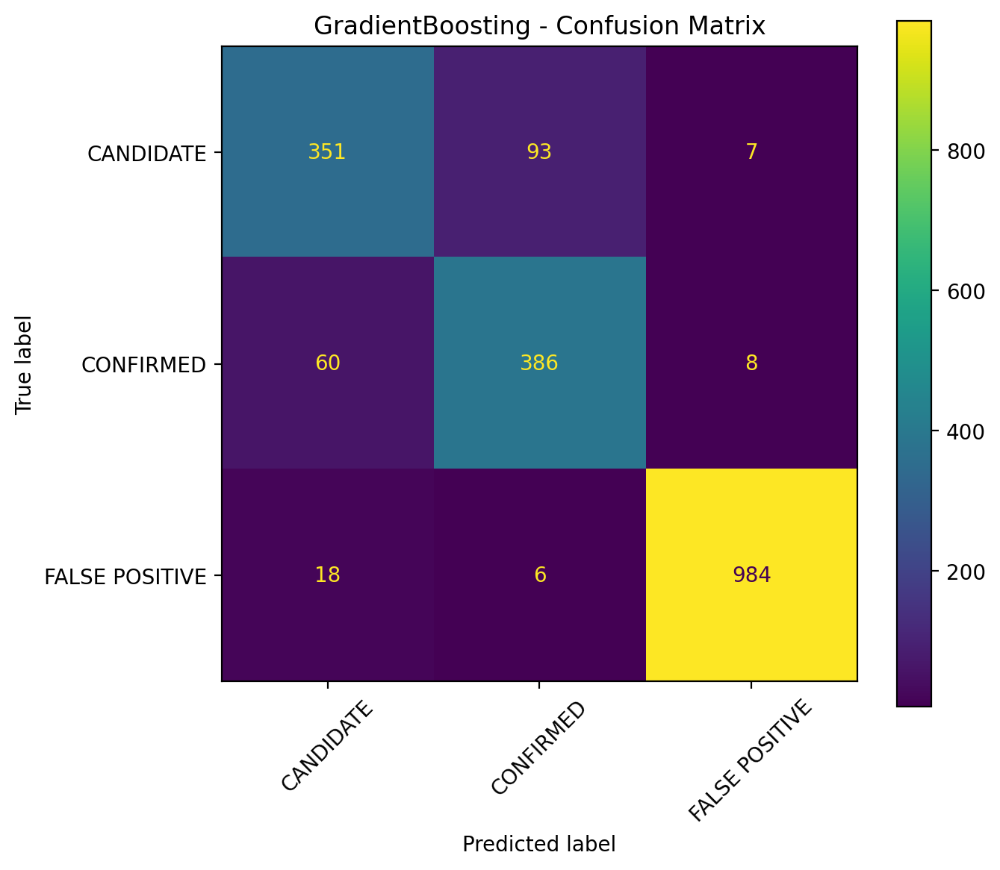
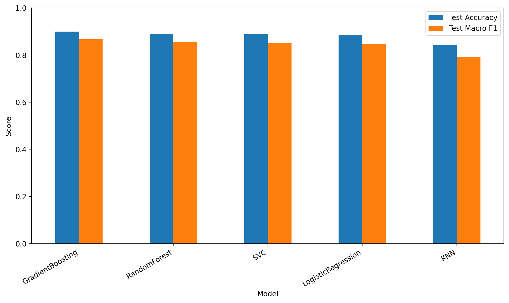
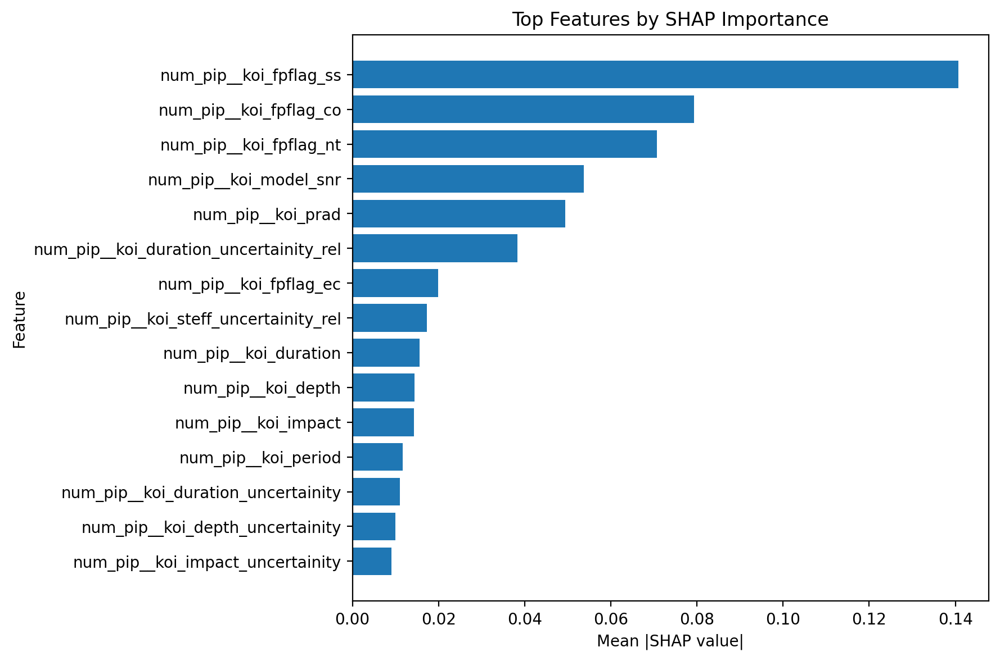

# 🔭 Kepler Exoplanet Search Prediction

An end-to-end Machine Learning project for classifying **Kepler Objects of Interest (KOIs)** into **Confirmed**, **Candidate**, and **False Positive** classes.

The project covers the complete ML workflow — from data preprocessing and feature engineering to model comparison, explainability with SHAP, model serialization, and deployment as an interactive Streamlit application.

---

## 🚀 Live Demo

### [🔗 Kepler | Exoplanet Classifier — Streamlit](https://kepler-exoplanet-prediction.streamlit.app/)

Try the deployed application directly:

**[Launch Kepler Exoplanet Classifier →](https://kepler-exoplanet-prediction.streamlit.app/)**

### Application Features

- 🔭 Generate random Kepler observations
- 📁 Upload CSV files for prediction
- 📊 View class probabilities
- 🧠 Get model predictions
- 🔍 Explore SHAP feature importance
- 📈 Compare different ML models
- 🎯 View the confusion matrix
- 🌌 Interactive astronomy-themed interface

---

## 📌 Project Overview

The **Kepler Space Telescope** collected a large number of observations of potential exoplanets.

This project uses Machine Learning to classify **Kepler Objects of Interest (KOIs)** based on their measured astronomical properties.

The target variable is:

```text
koi_disposition
```

The model predicts three classes:

| Class | Meaning |
|---|---|
| `CONFIRMED` | Object classified as a confirmed exoplanet |
| `CANDIDATE` | Object identified as a potential exoplanet candidate |
| `FALSE POSITIVE` | Object classified as unlikely to be an exoplanet |

---

# 🧠 Machine Learning Pipeline

```text
Raw Kepler Dataset
        │
        ▼
Data Cleaning
        │
        ▼
Leakage / Identifier Removal
        │
        ▼
Outlier Treatment
        │
        ▼
Uncertainty Feature Engineering
        │
        ▼
Missing Value Imputation
        │
        ▼
Feature Scaling
        │
        ▼
Feature Selection
        │
        ▼
Model Training
        │
        ▼
Hyperparameter Tuning
        │
        ▼
Model Comparison
        │
        ▼
SHAP Explainability
        │
        ▼
Model Serialization
        │
        ▼
Streamlit Deployment
```

---

# 🧹 Data Preprocessing

Several preprocessing steps were performed before model training.

## Leakage Prevention

Features that could directly reveal the target or introduce unwanted information were removed.

The following columns were excluded:

```text
koi_pdisposition
koi_score
```

Identifier and non-predictive columns were also removed where appropriate.

This was done to reduce the possibility of the model learning information that would not be available in a real prediction scenario.

---

## Outlier Treatment

Outliers were handled using percentile-based capping.

The thresholds were derived from the training data rather than the complete dataset to avoid leaking information from the test set.

---

## Missing Values

Missing numerical values were handled using:

```text
KNN Imputation
```

KNN imputation estimates missing values based on similar observations in the dataset.

---

## Feature Scaling

Numerical features were standardized using:

```text
StandardScaler
```

This places the numerical features on comparable scales and is particularly useful for algorithms that are sensitive to feature magnitude.

---

# 🧬 Feature Engineering

Uncertainty information from the Kepler measurements was incorporated into additional features.

Several measurements contain error estimates represented using `err1` and `err2`.

For a measurement:

```text
x
```

an uncertainty feature was created:

```text
x_uncertainity = err1 - err2
```

A relative uncertainty feature was also created:

```text
x_uncertainity_rel = (err1 - err2) / (x + ε)
```

where `ε` is a small value used to avoid division by zero.

These features were generated for measurements including:

```text
koi_period
koi_time0bk
koi_impact
koi_duration
koi_depth
koi_prad
koi_insol
koi_steff
koi_slogg
koi_srad
```

The original error columns were removed after the engineered uncertainty features were created.

---

# 🎯 Feature Selection

After preprocessing and feature engineering, statistical feature selection was performed using:

```text
SelectKBest
```

The final model uses:

```text
37 selected features
```

Feature selection helps reduce unnecessary dimensions and allows the model to focus on the most informative variables.

---

# 🤖 Models Compared

Several classification algorithms were evaluated:

- Logistic Regression
- Random Forest
- Gradient Boosting
- Support Vector Classifier
- K-Nearest Neighbors

Hyperparameters were optimized using:

```text
GridSearchCV
```

The models were compared using classification performance metrics on the held-out test set.

---

# 🏆 Final Model

The best-performing model in the evaluation was:

```text
GradientBoostingClassifier
```

## Test Performance

| Metric | Score |
|---|---:|
| Accuracy | ~89.96% |
| Macro F1 | ~86.7% |

The model performs strongly on the three-class classification problem.

The main difficulty observed during evaluation was distinguishing between **Candidate** and **Confirmed** observations, while **False Positive** observations were generally easier to separate.

---

# 📊 Model Evaluation

## Confusion Matrix

The confusion matrix provides a detailed breakdown of correct and incorrect predictions across the three classes.



---

## Model Comparison

The performance of the evaluated models is visualized below:



The underlying comparison data is available in:

```text
notebook/model_comparison.csv
```

---

# 🔍 Model Explainability

Model performance alone does not explain why a prediction was made.

**SHAP** was used to analyze the contribution of features to the model's predictions.

The SHAP analysis helps identify which astronomical measurements have the greatest influence on the classifier.

## SHAP Summary



Feature-level importance values are also available in:

```text
notebook/shap_feature_importance.csv
```

---

# 🌐 Streamlit Application

The trained model has been deployed as an interactive Streamlit application.

## Random Observation

The application can generate a random observation from the Kepler dataset and run it through the trained classifier.

Each time the user requests a new example, a new observation is selected from the dataset.

---

## CSV Prediction

Users can upload a CSV file containing observations and use the trained model to generate predictions.

The application applies the same preprocessing and feature-engineering workflow used during model development.

---

## Prediction Probabilities

The application displays the predicted probability for each class:

```text
CONFIRMED
CANDIDATE
FALSE POSITIVE
```

This provides more information than simply displaying the predicted class.

---

## Model Information

The application displays information about:

- Model performance
- Number of selected features
- Number of classes
- Prediction probabilities

---

## Explainability

The application also provides the generated SHAP analysis and model evaluation visualizations.

---

# 🗂️ Repository Structure

```text
KEPLER-EXOPLANET-PREDICTION/
│
├── data/
│   └── dataset.csv
│
├── notebook/
│   ├── kepler_analysis.ipynb
│   ├── confusion_matrix.png
│   ├── model_comparison.csv
│   ├── model_comparison.png
│   ├── shap_feature_importance.csv
│   └── shap_summary.png
│
├── app.py
├── kepler_model.pkl
├── kepler_deployment_artifacts.pkl
├── requirements.txt
├── .gitignore
└── README.md
```

---

# 🛠️ Tech Stack

## Programming

- Python

## Data Processing

- NumPy
- Pandas
- SciPy

## Machine Learning

- Scikit-learn
- Gradient Boosting
- GridSearchCV
- KNN Imputation
- SelectKBest
- StandardScaler

## Explainability

- SHAP

## Visualization

- Matplotlib
- Seaborn

## Deployment

- Streamlit
- Streamlit Community Cloud

## Development

- Jupyter Notebook
- VS Code
- Git
- GitHub

---

# ⚙️ Run Locally

## 1. Clone the repository

```bash
git clone https://github.com/siddhantshukla-coder/Kepler-Exoplanet-Prediction-Dataset.git
```

## 2. Move into the project directory

```bash
cd Kepler-Exoplanet-Prediction-Dataset
```

## 3. Install dependencies

```bash
pip install -r requirements.txt
```

## 4. Run the Streamlit application

```bash
python -m streamlit run app.py
```

The application will then be available at the local Streamlit URL displayed in the terminal.

---

# 📦 Model Artifacts

The repository contains serialized model artifacts used by the deployed application:

```text
kepler_model.pkl
kepler_deployment_artifacts.pkl
```

These artifacts allow the application to load the trained model and preprocessing information without retraining the model every time the application starts.

---

# 🔬 Methodology

The project follows a structured supervised learning workflow.

### Step 1 — Data Cleaning

Unusable, identifier, and leakage-prone columns were removed.

### Step 2 — Outlier Treatment

Training-derived percentile thresholds were used to cap extreme values.

### Step 3 — Feature Engineering

Measurement uncertainty features were generated from the available error estimates.

### Step 4 — Missing Value Handling

KNN-based imputation was used for missing numerical observations.

### Step 5 — Feature Scaling

Features were standardized using `StandardScaler`.

### Step 6 — Feature Selection

`SelectKBest` was used to select the most useful features for classification.

### Step 7 — Model Training

Multiple classification algorithms were trained and evaluated.

### Step 8 — Hyperparameter Optimization

`GridSearchCV` was used to search for better-performing model configurations.

### Step 9 — Model Evaluation

Models were compared using classification metrics, model comparison plots, and a confusion matrix.

### Step 10 — Explainability

SHAP was used to understand feature contributions to model predictions.

### Step 11 — Deployment

The final Gradient Boosting classifier was serialized and deployed through Streamlit.

---

# ⚠️ Limitations

This project is intended as a Machine Learning project and demonstration rather than a production-grade astronomical discovery system.

Important limitations include:

- The model is trained on the available Kepler dataset.
- Candidate vs. Confirmed classification is more difficult than False Positive detection.
- Model predictions depend on the quality and distribution of the input observations.
- The reported metrics are specific to the experimental train/test setup used in the project.
- Predictions should not be interpreted as independent scientific confirmation of an exoplanet.

---

# 🚀 Future Improvements

Potential improvements include:

- More rigorous cross-validation
- Integrating feature selection directly inside the cross-validation pipeline
- Probability calibration
- More extensive hyperparameter optimization
- XGBoost / LightGBM experimentation
- Additional astronomical feature engineering
- Improved class-imbalance handling
- Larger and more diverse astronomical datasets
- Model monitoring after deployment
- More detailed prediction explanations
- Automated model retraining

---

# 👨‍💻 Author

**Siddhant Shukla**

IIT Bhilai  
Data Science & Artificial Intelligence

---

# ⭐ Live Application

## [🚀 Launch Kepler Exoplanet Classifier](https://kepler-exoplanet-prediction.streamlit.app/)

Try the deployed application and explore how Machine Learning can be used to classify Kepler Objects of Interest.

If you find the project interesting, consider giving the repository a ⭐ on GitHub.
